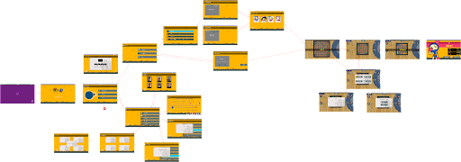

# Indie Studio (Bomberman) :bomb:

## $\color{green}{Grade: A}$

## About the project

**The aim of the Indie Studio is to implement a cross-platform 3D video game with real-world tools.**

> A more detailed video is available [here](https://www.youtube.com/watch?v=_IWi5skP5Hg)

<div align="center">


  
</div>

[Bomberman](https://en.wikipedia.org/wiki/Bomberman) is a well known game, where the player embodies a bomber, the goal being to explode the opponents/enemies to win.

Our gameplay reference is **Neo Bomberman**, released on the Neo Geo and MVS systems in 1997.

### Library 

We used the [Raylib](https://www.raylib.com) library to create the game, which is a simple and easy-to-use library to enjoy videogames programming.

## Features

### Mini view of all the menus and the gameplay

<div align="center">



</div>

### Gameplay

These are the features we implemented:

- Local multi-player with the possibility to play with a friend + AI’s controlled bots
- Some menus:
  - loading menu (all the assets are loaded in the background)
  - main menu
  - pause menu
  - settings menu
  - game over menu
  - victory menu
  - map selection menu
  - loading map/game menu
  - game mode selection menu
  - bind keys menu
  - volume menu
  - framerate menu
  - credits menu
  - select player menu
  - etc...
- A game with 3D graphics but a 2D gameplay
- Procedurally generated maps (random obstacles, random bonus...)
- Save/Load a game
- Animation and sounds to give life to the game (especially during various interactions)
- Some Power-ups:
  - Bomb Up / Bomb Down
  - Speed Up / Speed Down
  - Fire Up / Fire Down

---

## Getting Started

### Setup
```
$ bash .github/scripts/setup.sh
```

### Build & Execute
```
$ cd build
$ cmake ..
$ cmake --build .
$ cd ..

$ ./build/bomberman
```

### Generate Doxygen
```
$ cmake -DDOXYGEN=ON ..
```

### Run Unit Tests
```
$ cmake -DUNIT_TEST=ON ..

$ ./build/unit_tests
```
